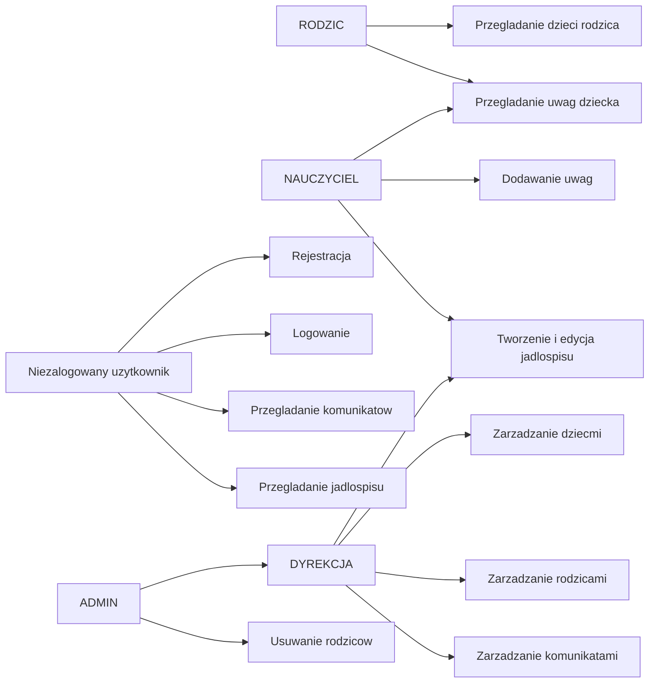

# Projekt REST API z kontrola dostepu RBAC

## Role

| Rola | Zakres odpowiedzialnosci |
| --- | --- |
| Niezalogowany uzytkownik | Przeglada publiczne komunikaty i jadlospis, moze zalozyc konto rodzica. |
| RODZIC | Przeglada dane swoich dzieci i uwagi przypisane do dziecka. |
| NAUCZYCIEL | Dodaje uwagi oraz zarzadza jadlospisem. |
| DYREKCJA | Zarzadza dziecmi, rodzicami, komunikatami i jadlospisem bez usuwania rodzicow. |
| ADMIN | Pelne zarzadzanie systemem, w tym usuwanie rodzicow. |

## Diagram przypadkow uzycia

## Endpointy

| Metoda | Endpoint | Dostep | Opis zadania | Przykladowa odpowiedz |
| --- | --- | --- | --- | --- |
| POST | `/api/auth/register` | publiczny | Rejestracja rodzica. | `{ "token": "...", "email": "rodzic@test.pl", "rola": "RODZIC" }` |
| POST | `/api/auth/login` | publiczny | Logowanie i wydanie JWT. | `{ "token": "...", "email": "admin@test.pl", "rola": "ADMIN" }` |
| GET | `/api/posts` | publiczny | Lista opublikowanych komunikatow. | lista obiektow `Post` |
| GET | `/api/posts/{id}` | publiczny | Szczegoly opublikowanego komunikatu. | obiekt `Post` |
| GET | `/api/admin/posts` | DYREKCJA, ADMIN | Lista wszystkich komunikatow. | lista obiektow `Post` |
| GET | `/api/admin/posts/{id}` | DYREKCJA, ADMIN | Szczegoly komunikatu. | obiekt `Post` |
| POST | `/api/admin/posts` | DYREKCJA, ADMIN | Utworzenie komunikatu. | obiekt `Post` |
| PUT | `/api/admin/posts/{id}` | DYREKCJA, ADMIN | Edycja komunikatu. | obiekt `Post` |
| DELETE | `/api/admin/posts/{id}` | DYREKCJA, ADMIN | Usuniecie komunikatu. | brak tresci |
| GET | `/api/posilki` | publiczny | Lista jadlospisow. | lista obiektow `Jadlospis` |
| GET | `/api/posilki/{id}` | publiczny | Szczegoly jadlospisu. | obiekt `Jadlospis` |
| POST | `/api/posilki` | NAUCZYCIEL, DYREKCJA, ADMIN | Dodanie jadlospisu. | obiekt `Jadlospis` |
| PUT | `/api/posilki/{id}` | NAUCZYCIEL, DYREKCJA, ADMIN | Edycja jadlospisu. | obiekt `Jadlospis` |
| DELETE | `/api/posilki/{id}` | DYREKCJA, ADMIN | Usuniecie jadlospisu. | brak tresci |
| GET | `/api/rodzice/{idRodzica}/dzieci` | RODZIC, NAUCZYCIEL, DYREKCJA, ADMIN | Lista dzieci przypisanych do rodzica. | lista obiektow `Dziecko` |
| GET | `/api/admin/dzieci` | DYREKCJA, ADMIN | Lista wszystkich dzieci. | lista obiektow `Dziecko` |
| GET | `/api/admin/dzieci/{id}` | DYREKCJA, ADMIN | Szczegoly dziecka. | obiekt `Dziecko` |
| POST | `/api/admin/dzieci` | DYREKCJA, ADMIN | Dodanie dziecka. | obiekt `Dziecko` |
| PUT | `/api/admin/dzieci/{id}` | DYREKCJA, ADMIN | Edycja dziecka. | obiekt `Dziecko` |
| DELETE | `/api/admin/dzieci/{id}` | DYREKCJA, ADMIN | Usuniecie dziecka. | brak tresci |
| GET | `/api/rodzice` | DYREKCJA, ADMIN | Lista rodzicow. | lista obiektow `Rodzic` |
| GET | `/api/rodzice/{id}` | DYREKCJA, ADMIN | Szczegoly rodzica. | obiekt `Rodzic` |
| POST | `/api/rodzice` | DYREKCJA, ADMIN | Dodanie rodzica lub konta z rola. | obiekt `Rodzic` |
| PUT | `/api/rodzice/{id}` | DYREKCJA, ADMIN | Edycja rodzica. | obiekt `Rodzic` |
| DELETE | `/api/rodzice/{id}` | ADMIN | Usuniecie rodzica. | brak tresci |
| GET | `/api/uwagi/dziecko/{idDziecka}` | RODZIC, NAUCZYCIEL, DYREKCJA, ADMIN | Uwagi przypisane do dziecka. | lista obiektow `Uwaga` |
| GET | `/api/uwagi` | NAUCZYCIEL, DYREKCJA, ADMIN | Lista wszystkich uwag. | lista obiektow `Uwaga` |
| POST | `/api/uwagi` | NAUCZYCIEL, DYREKCJA, ADMIN | Dodanie uwagi. | obiekt `Uwaga` |

## Konta demonstracyjne

| Email | Haslo | Rola |
| --- | --- | --- |
| `admin@test.pl` | `admin123` | ADMIN |
| `dyrekcja@test.pl` | `dyrekcja123` | DYREKCJA |
| `nauczyciel@test.pl` | `nauczyciel123` | NAUCZYCIEL |
| `rodzic@test.pl` | `rodzic123` | RODZIC |

## Zasady bezpieczenstwa

- JWT przechowuje email w `subject` i role w claimie `rola`.
- Spring Security mapuje role na uprawnienia `ROLE_RODZIC`, `ROLE_NAUCZYCIEL`, `ROLE_DYREKCJA`, `ROLE_ADMIN`.
- Nowe konta tworzone przez `/api/auth/register` i `/api/rodzice` zapisuja hasla przez BCrypt.
- Publiczne sa tylko rejestracja, logowanie, opublikowane komunikaty i jadlospis.
